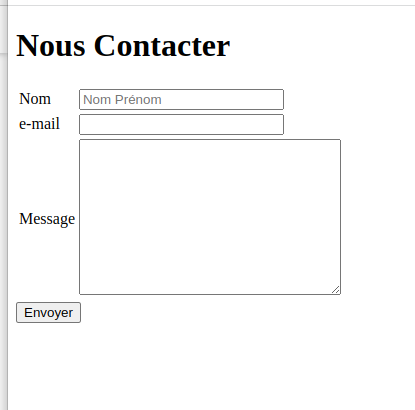

# TP03-G1
Un TP sur les balises HTML

<ol>
        <li>Dans un répertoire de votre choix clonner le repo sur vos machine</li>
        <li>Changer le répertoire vers le répertoire cloné</li>
        <li>Vous taper <code>code .</code> pour lancer vscode</li>
        <li>Vous créer le fichier index.html puis enregistrer les modifications avec le repo git avec le message "initializing project"</li>
        <li>Vous envoyer vos modification sur votre reop github</li>
        <li>Inserer nu e image de votre choix img.png</li>
        <li>Modifiez le fichier index.html pour obtenir le résultat suivant</li>
        
        <li>Enregistrez vos modification localement puis sur github avec le message "Fin page d'acceuil"</li>
        <li>créer trois autres fichier : apropos.html, contact.html et Languages.html dans le répertoire de travaille</li>
        <li>Enregistrer les modification apportées à votre espace de travaille sur github avec le message "Ajout des pages : apropos.html, contact.html et Languages.html "</li>
        <li>Modifiez les fichiers html pour obtenir les résultats suivantes :</li>
        <ul>
                <li>languages.html</li>
                <li>aproppos.html</li>
                <li>contact.html</li>
        </ul>
        <li>Enregistrer les modifications apportées à votre espace de travail dans le repo git avec le message "contenue des pages html à été mis à jour"</li>
        <li>Modifier les fichier fichier index.html pour créer des liens vers les autres pages</li>
        <li>Refaire la même chose pour les autres fichiers</li>
        <li>Enregistrer les modifications apportées à votre espaces de travail dans le repo git avec le message "Fin HTML"</li>
    </ol>
